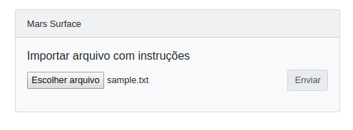

# Mars Explorer





## Using the command line

### Setup
Install bundler and then

```bash
  bundle install
  ruby mars_explore_cli.rb sample.txt
```


```bash
  ruby mars_explore_cli.rb sample.txt
```

## Using sinatra

You can use the provided sinatra app to upload files via a web interface. Each uploaded file will handled and the results stored on mongo db instance

### Directly via rackup
You need a running mongodb instance on its default port. Host can be configured via _MONGO_HOST_ env var.

```bash
  rackup -p 3000
```


### Docker-compose

```bash
  docker-compose up
```
